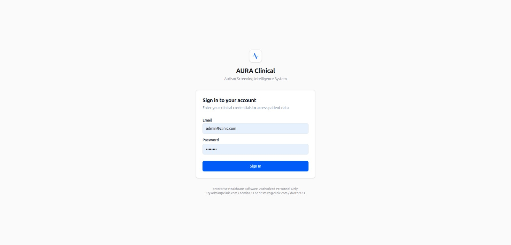
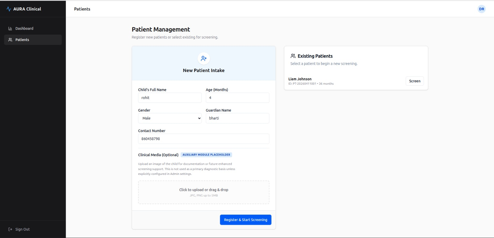
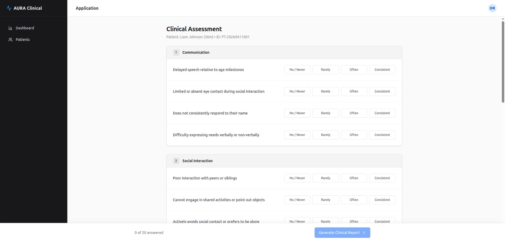
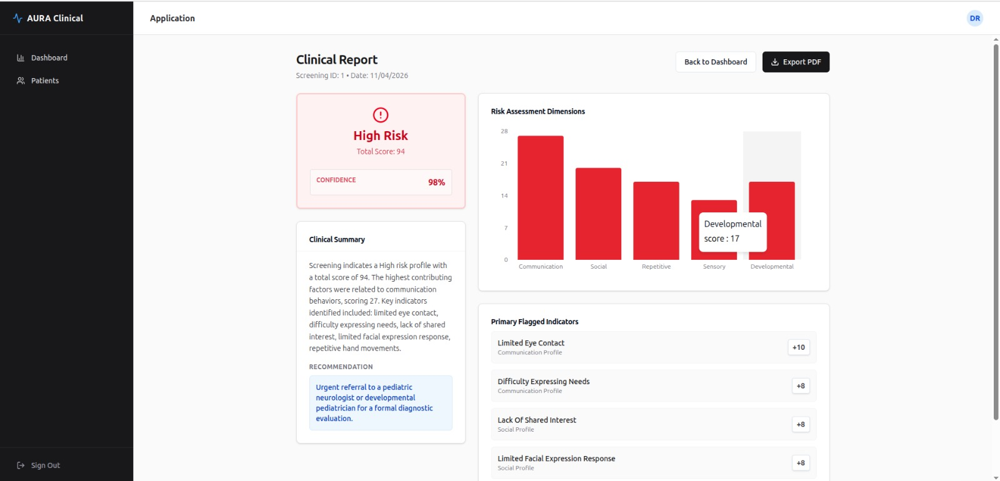
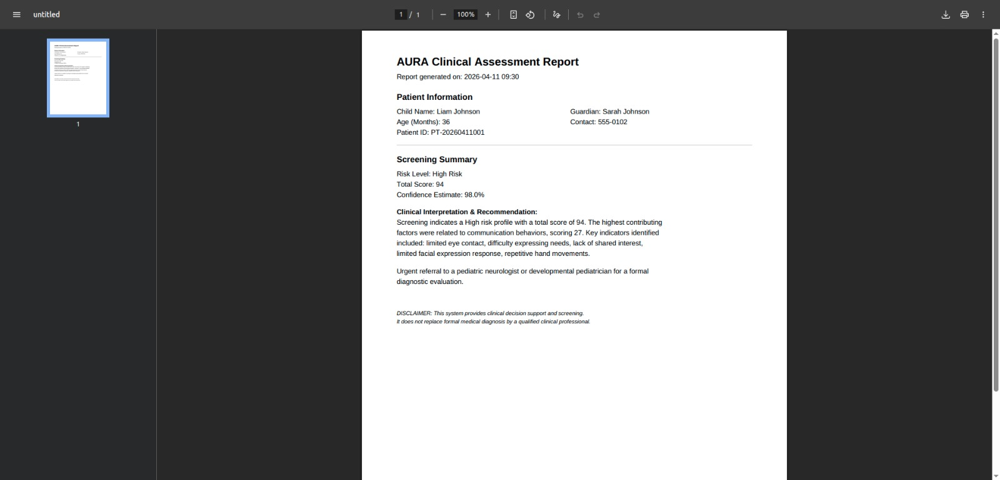

# AURA Clinical: Autism Spectrum Disorder (ASD) AI Detection System

## Overview
AURA Clinical is a production-grade, enterprise-ready Intelligence Engine developed by **Rohit Bagewadi** to assist clinical staff in the early diagnosis of Autism Spectrum Disorder (ASD). The system integrates deterministic behavioral rule-based algorithms with probabilistic Machine Learning and Deep Learning parameters (Convolutional Neural Networks and Random Forest classifiers) to map patient telemetry, analyze facial tensors, and synthesize clinical decision support reports.

The application architecture utilizes a React.js frontend tailored to mirror high-fidelity Electronic Medical Record (EMR) systems and an asynchronous Python FastAPI backend handling dense mathematical inferences. 

## About the Project
AURA Clinical was built to address the critical need for early, accessible, and automated screening for Autism Spectrum Disorder (ASD) in young children. Early detection is widely recognized as a key factor in improving long-term developmental outcomes. This project bridges parental concerns and clinical diagnosis by providing developmental clinicians with a powerful, multi-modal screening assistant.

### Key Capabilities & Methodology
- **Multi-Modal Assessment**: Combines behavioral screening questions (evaluating communication, social interaction, repetitive behaviors, sensory processing, and milestone delays) with vision-based AI classification.
- **Explainable Machine Learning**: Uses a Random Forest Classifier trained on key behavioral indicators. Instead of just a binary score, it evaluates dimension-specific risks and maps key contributing factors to explain *why* a particular risk level was assigned.
- **Deep Learning Vision Engine**: Leverages a Deep Convolutional Neural Network (CNN) based on the **MobileNetV2** architecture (using transfer learning) to evaluate patient facial image arrays and output phenotypical classification probabilities.
- **Dynamic Decision Support & PDF Report Generation**: Synthesizes tabular and vision inferences into a unified assessment report, dynamically generating clinical-grade PDFs using `ReportLab` that can be integrated into Electronic Medical Records (EMR).

## Visual Interface
### Authentication Gateway


### Patient Management and Data Intake


### Clinical Assessment Engine


### Diagnostic Results Dashboard


### Automated Clinical Report


## System Architecture
The repository is split into two primary operational environments:

1. **/backend (Intelligence Engine)**
   - **Framework:** Python, FastAPI, SQLAlchemy
   - **Database:** SQLite (Fallback configuration for local execution constraints)
   - **Machine Learning Core:**
     - **Tabular Intelligence (`ml_engine.py`):** Random Forest Classifier utilizing the `scikit-learn` ecosystem, calculating multi-axial behavioral scores (Communication, Social, Repetitive, Sensory, Developmental).
     - **Vision Analysis (`image_engine.py`):** Deep Convolutional Neural Network utilizing `tensorflow` Keras `MobileNetV2` architecture. Scales and processes human facial tensor arrays (224x224x3) to determine neurodevelopmental phenotype probability.
     - **Reporting Framework:** Automates deterministic, printable clinical manifests using `ReportLab`.
   - **Authentication:** Synchronous JWT encoding leveraging `bcrypt` password hashing protocols.

2. **/frontend (Clinical Operations Dashboard)**
   - **Framework:** React 18, Vite, Typecript
   - **User Interface:** TailwindCSS, Shadcn/UI primitives.
   - **Data Visualization:** `Recharts` for dimensional plotting.
   - **Modules:** Patient Management, Asynchronous Media Upload, Multi-Phase Screening Form, Clinical Role-Based Administrator Dashboard.

## Hardware Prerequisites
Minimum system requirements derived from standard deployment targets:
- Processor: Quad-Core Architecture (Intel Core i3 or equivalent)
- RAM: Minimum 8 GiB
- Storage: 256 GB HDD/SSD availability
- Operating System: UNIX/Linux preferred, Windows compliant.

## Installation and Execution Protocol

### 1. Backend Initialization
Ensure Python 3.10+ is installed on your local environment.

```bash
# Navigate to the backend directory
cd backend

# Instantiate a virtual environment
python3 -m venv venv
source venv/bin/activate  # On Windows execution: venv\Scripts\activate

# Install the Intelligence Engine dependencies (Includes TensorFlow)
pip install -r requirements.txt

# Seed the clinical database with base synthetic parameters and logic
python3 seed.py

# Boot the ASGI Server instance
uvicorn main:app --host 0.0.0.0 --port 8000
```
Note: Upon the first computational run of the facial image upload, the CNN framework will trigger a dummy compilation epoch to initialize and lock its mathematical `autism_vision_model.h5` graph local binary.

### 2. Frontend Initialization
Ensure Node.js (Version 18+) is active. Open a concurrent terminal.

```bash
# Navigate to the frontend directory
cd frontend

# Install Node modules
npm install

# Initialize the frontend local execution process
npm run dev
```
The React client operates on `http://localhost:5173`. 

## Base Authentication Vectors
The system is seeded with enterprise demonstration accounts. Input these coordinates to bypass the auth gateway:
- **Administrator Role:** `admin@clinic.com` | Password: `admin123`
- **Clinical Role:** `dr.smith@clinic.com` | Password: `doctor123`

## Clinical Disclaimers
AURA Clinical serves specifically as an algorithmic diagnostic support parameter. Mathematical probabilities output by this engine do not constitute definitive pediatric or neurological diagnoses and must be reviewed by accredited developmental health specialists.

## Legal and Administrative Constraints
Clinical Framework developed by Rohit Bagewadi. Codebase governed under the attached MIT License constraints. Unauthorized data ingestion tracking is strictly monitored via the internal administration matrix.
